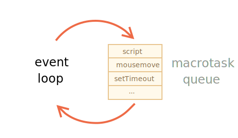
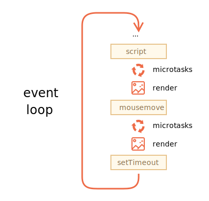

部分翻译自：<https://javascript.info/event-loop>
# MicroTask & MacroTask
## Event Loop & MacroTask队列 
### Event Loop
特征是：
1. Endless loop
2. Javascript Engine空闲且等待Tasks, 执行Event Loop, 并等待执行更多的更多的Taks
3. 例如：
  + `<script src =" ... ">` loads完成，然后Event loop会去执行其中的代码。(或者是console中加的代码)
  + 用户mouseMove, 或其他action触发了事件，Event loop 会执行Handlers
  + 有setTimeout时间到了，Event loop会去执行它的callback
  
  

  Note: 
  1. 我们平时执行的script也是EventLoop来操作的
  2. Rendering never happens while the engine executes a task. 无论这个task执行多久，仅当task完成时才会有Dom changes.
  3. 如果一个task占的时间过长，这时候页面都会是停滞状态，如果是进入到Infinite Loop，页面会显示"停止响应"。

## MicroTask队列 (范围是？)
```javascript
  let promise = Promise.resolve();
  promise.then(() => alert("promise done!"));
  alert("code finished"); // this alert shows first
```
即使一个Promise已经被resolved了，但是它的`.then`/`.catch`/`.finally`会被异步执行，为什么呢？

ES8使用“MicroTask queue”来描述“Promise Jobs”, 在规范中：
1. 先进先出策略
2. 队列中的Task仅当没有其他code running时才能被初始化

### Example 1
```javascript
  let promise = Promise.reject(new Error("Promise Failed!"));
  setTimeout(() => promise.catch(err => alert('caught')), 1000);

  // Error: Promise Failed!
  window.addEventListener('unhandledrejection', event => alert(event.reason));
```

`Promise Failed` => then `caught`

其中`unhandledRejection`先捕捉到Error，是因为microTask队列中的Task是空的。

Javascript runtime检测promises，如果已经有any of them处于`rejected`的状态中，则触发`unhandledrejection`的EventHandler.

### Example 2
```javascript
setTimeout(() => alert("timeout"));

Promise.resolve()
  .then(() => alert("promise"));

alert("code");
```
执行顺序为
1. "code" => 同步调用
2. "promise" => code执行完时检测microTask队列，并执行
3. "timeout" => 最后执行，因为他是macroTask

## MircroTask 和 MacroTask协调工作
 
 
 1. All microtasks are completed before any other event handling or rendering or any other macrotask takes place.
 2. 如果我们想要异步执行一个function(after the current code), 但是在rendering之前，我们可以使用`queueMicroTask`来schedule.
  + 一般 `queueMicroTask`很少用，一些框架可能会用到，在这个接口出来之前，一般用`Promise.resolve().then(()=>{...code...})`来执行
